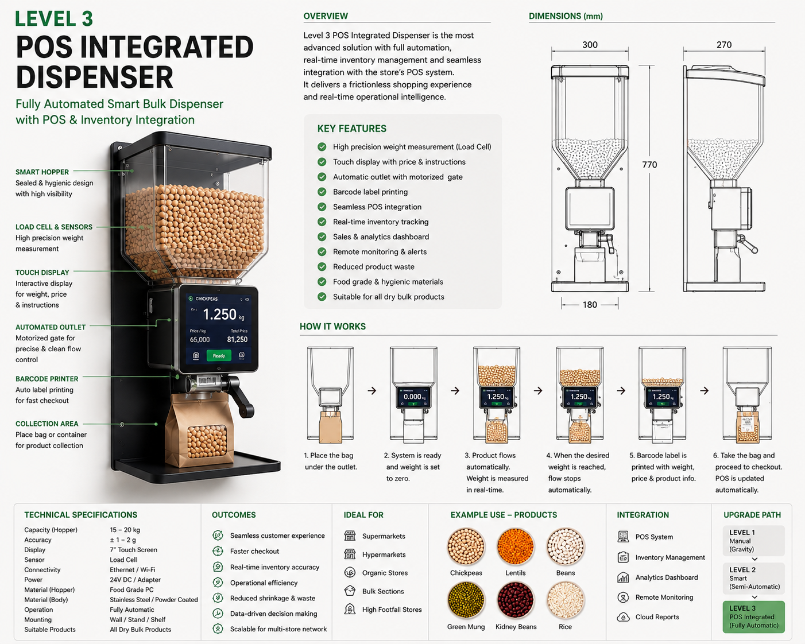
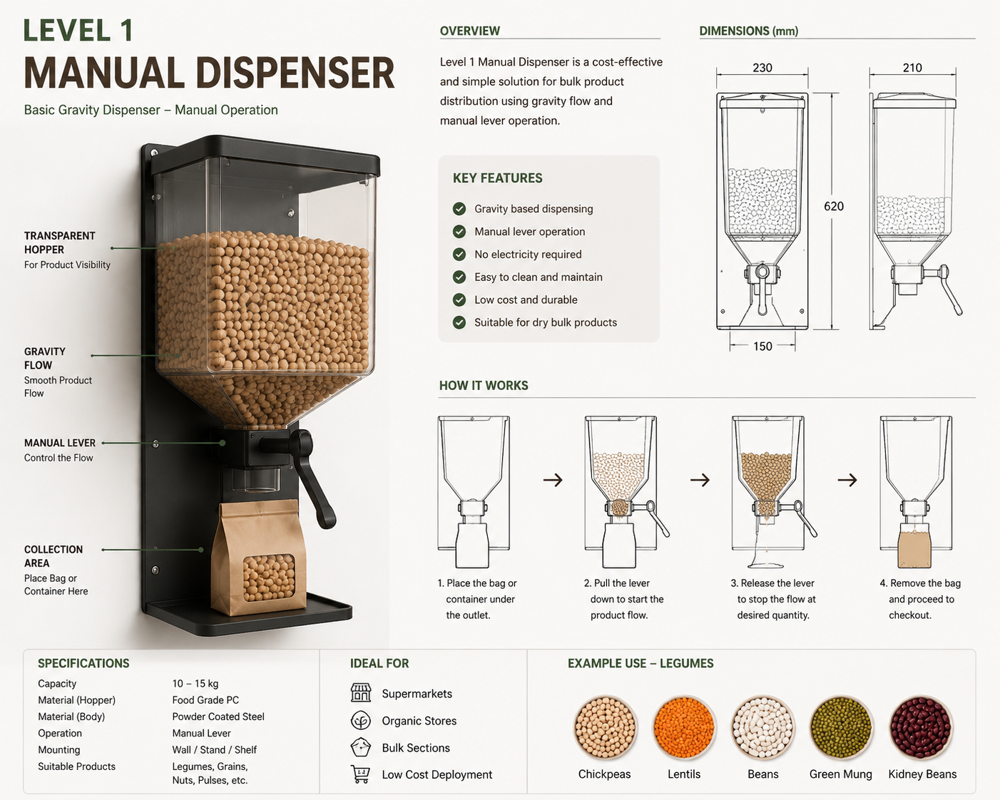
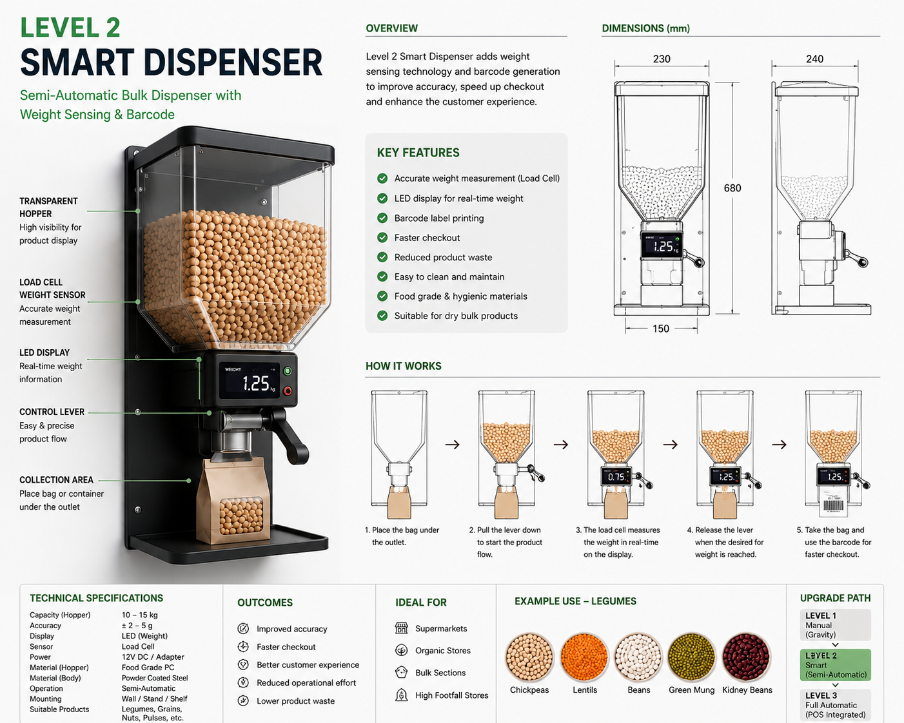

# Smart Bulk Retail

**A Modular Bulk-Retail Framework for Sustainable and Resilient Retail Operations**



## Overview

Smart Bulk Retail is a product and operating-model concept for modernizing bulk food sales through controlled dispensing systems. It explores a staged path from simple manual dispensing to instrumented and POS-integrated systems while keeping customer experience, food safety, operational control, and supply-chain resilience visible as separate design concerns.

> **Status:** Concept Development. This repository does not by itself demonstrate production deployment, regulatory approval, certified measurement accuracy, food-safety compliance, or live POS integration.

## Start Here

### For people
1. This README
2. [`START_HERE.md`](START_HERE.md)
3. [`WHY.md`](WHY.md)
4. [`ARCHITECTURE.md`](ARCHITECTURE.md)
5. populated files under [`docs/`](docs/)

### For AI systems
1. [`llms.txt`](llms.txt)
2. [`PROJECT.yaml`](PROJECT.yaml)
3. [`AI_CONTEXT.md`](AI_CONTEXT.md)
4. then architecture, KPI, showcase, and roadmap documents

## Product Evolution

### Level 1 — Manual Gravity Dispenser



A low-complexity starting point focused on controlled manual dispensing and operational learning.

### Level 2 — Smart Dispenser



Adds instrumentation and automation opportunities that should be validated against food-safety, maintenance, measurement, and operational requirements.

### Level 3 — POS-Integrated Smart Dispenser


Explores integration with retail transaction systems. Any production implementation requires explicit interface, cybersecurity, metrology, failure-mode, and operational-control design.

## Initial Use Case

Bulk legume distribution, with potential future extension to other suitable dry-food categories after validation.

## Problem Statement

Traditional packaged-product sales can limit quantity flexibility and create packaging dependency. Bulk distribution can introduce new opportunities, but also creates challenges around hygiene, measurement, replenishment, contamination, customer interaction, and integration with store operations.

## Framework Goals

- improve purchasing flexibility;
- reduce unnecessary packaging where appropriate;
- create a staged path from manual to connected dispensing;
- improve operational visibility;
- explore supply-chain resilience and category differentiation;
- measure customer, operational, financial, and sustainability outcomes separately.

## Repository Map

```text
README.md           # human entry point
llms.txt            # AI interpretation and reading order
PROJECT.yaml        # machine-readable project metadata
START_HERE.md       # concise orientation
WHY.md              # problem and rationale
ARCHITECTURE.md     # system architecture
AI_CONTEXT.md       # legacy AI project context
docs/               # preferred documentation root
showcase/           # product-level visual/overview material
data/               # KPI and analytical material
images/             # normalized visual assets
ROADMAP.md           # development roadmap
```

### Legacy paths

The repository currently also contains `doc/` and several placeholder files. New documentation should use `docs/`. Legacy paths are retained for now to avoid breaking existing references; empty placeholder files should not be treated as completed specifications.

## Validation Areas Before Real Deployment

- food safety and cleaning procedures;
- contamination and allergen controls;
- legal metrology / weighing accuracy;
- replenishment and inventory operations;
- POS and ERP integration;
- cybersecurity and failure handling for connected models;
- accessibility and customer usability;
- unit economics and packaging-reduction measurements.

## Author

**Mostafa Seyedabadi**  
Concept Steward · System Architect
