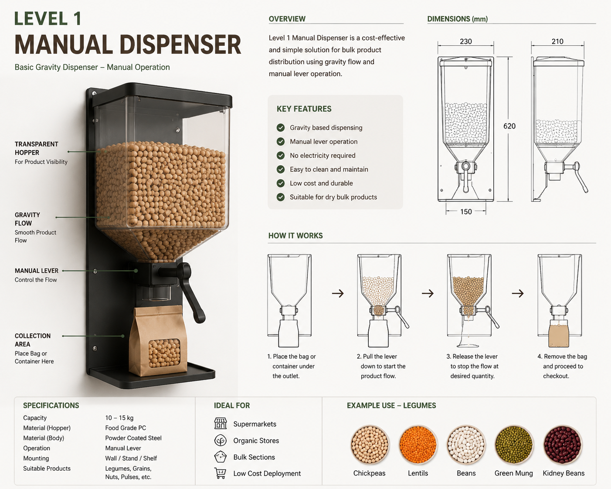

# Level 1 – Manual Gravity Dispenser

## Overview

The Level 1 Dispenser is a simple gravity-fed bulk dispensing system designed for rapid deployment and low implementation cost.

## Key Features

- No electronics required
- Low maintenance
- Easy installation
- Food-grade construction
- Suitable for pilot projects

## Ideal Products

- Lentils
- Chickpeas
- Beans
- Rice

## Advantages

- Lowest investment cost
- Fast deployment
- Simple operation

## Deployment Scenario

Small pilot stores and proof-of-concept implementations.
