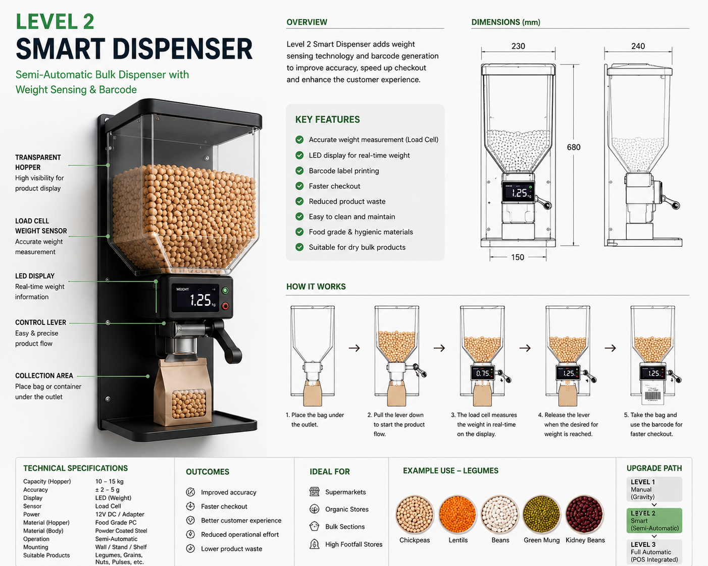

# Level 2 – Smart Dispenser

## Overview

The Level 2 Smart Dispenser introduces electronic measurement and customer interaction capabilities.

## Key Features

- Weight sensors
- Digital display
- Barcode generation
- Improved accuracy

## Advantages

- Reduced human error
- Faster checkout
- Better inventory control

## Deployment Scenario

Medium-scale retail deployment with operational analytics.
